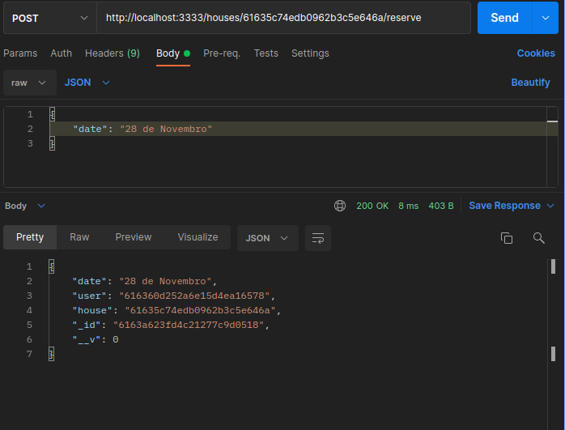

<h1 align="center">devHouse API</h1>
 

# :pushpin: Index
- Routes
  - [GET](#camera_flash-project-media)
  - [POST](#camera_flash-project-media)
  - [PUT](#camera_flash-project-media)
  - [DELETE](#camera_flash-project-media)
- [About](#monocle_face-about)
- [Technologies](#rocket-tecnologias-usadas)
- [Autor](#closed_book-author)
 
---
# :package: Routes

### These prints were taken using postman!
The routes were created using route params, query params and headers.  
Some of the routes use user id verification in the request header.

---

## :file_folder: GET

Get created houses by user.

Get reserves made by user.

Get houses depend on status.

## :file_folder: POST
Reserve house.

Create house.

Create house - Invalid body request

Login by email - Invalid email

Login by email

## :file_folder: PUT
Updated house.

Update house - Invalid body request

## :file_folder: DELETE
Delete Reserve

Delete House

Delete House - Invalid user_id header request

 

---
# :monocle_face: About
This project was developed with the intention of being a robust API that can create, read, update, delete and reserve houses. All this using several validations and also using Yup.
 

---

# :rocket: Technologies
This project was developed with the following technologies:  
- :heavy_check_mark: **NodeJS**
- :heavy_check_mark: **Express**
- :heavy_check_mark: **MongoDB**
- :heavy_check_mark: **Mongoose**
- :heavy_check_mark: **Multer**
- :heavy_check_mark: **CORS**
- :heavy_check_mark: **Yup**
- :heavy_check_mark: **Sucrase**
  
 

---

# :closed_book: Author
By Patrick Morais.
### :link: LinkedIn: https://www.linkedin.com/in/patrick-morais/